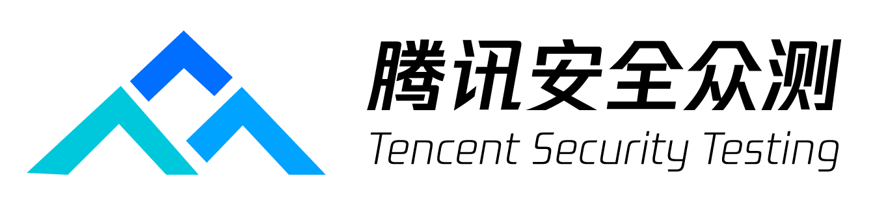
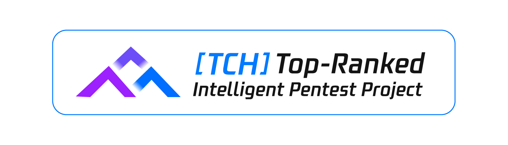

<div align="center">


# Cairn
### More Than Just AI Penetration Testing 鈥?Towards General State-Space Search

<p>
  <a href="https://zc.tencent.com/hackathon" target="_blank" rel="noopener noreferrer">
    
  </a>
  <a href="https://zc.tencent.com/hackathon" target="_blank" rel="noopener noreferrer">
    
  </a>
</p>

Cairn is a general-purpose problem-solving engine. <br/>It defines no roles, no workflows. Given an origin and a goal, it searches for a path through an unknown state space. <br/>AI Penetration Testing is one such problem 鈥?and a proven one.

<p>
  <a href="https://discord.gg/nDSy4NZVP" target="_blank" rel="noopener noreferrer">
    
  </a>
  <a href="https://x.com/le1xia0" target="_blank" rel="noopener noreferrer">
    
  </a>
</p>

</div>

<p align="center">
  <a href="https://www.bilibili.com/video/BV1a8R5BhEVi/" target="_blank" rel="noopener noreferrer">
    
  </a>
</p>

## What is Cairn?

Penetration testing is fundamentally a **directed search through a near-infinite state space**:

- **Origin**: known (target IP, target system)
- **Goal**: defined (get a shell, capture the flag)
- **Path**: unknown

This structure is not unique to penetration testing. Vulnerability research, mathematical proof, CTF challenges 鈥?any problem with a clear starting point, a clear success condition, and an unknown path in between shares the same shape.

Cairn is built for this class of problems. Penetration testing is the first domain it has been validated on.

The engine is built on a **Blackboard Architecture** with an explicit fact-intent graph. Three primitives are all it needs:

| Concept | Meaning |
|---------|---------|
| **Fact** | A confirmed, objective finding written to the board |
| **Intent** | A declared direction of exploration, not yet executed |
| **Hint** | Human judgment injected at any time; absorbed by agents on the next read |

The graph grows from `origin` toward `goal`. Every new Fact is a stepping stone; every Intent is a step into the unknown.

Agent Workers run an OODA loop 鈥?Observe the full graph, Orient to the current state, Decide on next intents, Act to explore 鈥?and write their findings back as new Facts. Workers have no fixed roles. Tasks are generated at runtime from the graph's current state, not from predefined job descriptions.

Agents coordinate exclusively through the shared board (Stigmergy). No direct communication. No information silos.

## Cairn in Action

https://github.com/user-attachments/assets/e557b1ac-dda4-41cb-87dd-9d56dbf05133


## How It Works

Three task types, all executed by the same Worker:

| Task | What it does | Output |
|------|-------------|--------|
| **Bootstrap** | At project start, attempts to solve the problem directly | Fact + possible Complete |
| **Reason** | Reads the full graph: is the goal met? What should be explored next? | Complete / new Intents / no-op |
| **Explore** | Claims one Intent, executes the exploration, reports findings | One Fact |

### Parent-Child project architecture

Projects use a process hierarchy instead of one shared single-goal worker pool:

- One dedicated **Parent Agent** is selected when the project is created. It performs orchestration only: it decomposes the project into independent Child directions, reviews structured results, allocates participating Agents, forwards rewritten evidence, and completes the Parent goal.
- Every Parent Intent materializes as one **Child project** with its own Origin, Goal, fact-intent graph, task queue, workspace, logs, and operating-system dispatcher process. A Child runs the original Bootstrap/Reason/Explore loop and cannot create grandchildren.
- Children never read each other. The Parent reads Child Facts, summaries, and Blackboard events instead of complete execution logs. Cross-Child evidence is delivered only as a concise Parent Hint.
- One participating Agent belongs to at most one Child at a time. Reassignment increments its assignment epoch and creates a fresh `CODEX_HOME`, so the Agent does not retain the previous Child's session memory.
- With `N` participating Agents, at most `N` Children are active and at most `N+1` Children remain unfinished. Every active Child keeps at least one Agent; lower-priority Children are paused when capacity is unavailable.
- A Child failure is isolated to its own process and is restarted without taking down its siblings. Completing a Child releases its Agents; completing the Parent stops all remaining Children.

The shared Parent Blackboard records Child creation, allocation, process state, published Facts, breakthroughs, summaries, and Parent Hint deliveries. It is the information boundary between the orchestration layer and isolated Child graphs.

System architecture:

```
          鈹屸攢鈹€鈹€鈹€鈹€鈹€鈹€鈹€鈹€鈹€鈹€鈹€鈹€鈹€鈹€鈹€鈹€鈹€鈹€鈹€鈹€鈹€鈹€鈹€鈹€鈹€鈹€鈹€鈹€鈹€鈹€鈹€鈹€鈹€鈹?
          鈹?          Cairn Server           鈹?
          鈹?   Facts + Intents + Hints       鈹?
          鈹斺攢鈹€鈹€鈹€鈹€鈹€鈹€鈹€鈹€鈹€鈹€鈹€鈹€鈹€鈹€鈹€鈹€鈹攢鈹€鈹€鈹€鈹€鈹€鈹€鈹€鈹€鈹€鈹€鈹€鈹€鈹€鈹€鈹€鈹?
                            鈹?
                     Read / Write API
                            鈹?
          鈹屸攢鈹€鈹€鈹€鈹€鈹€鈹€鈹€鈹€鈹€鈹€鈹€鈹€鈹€鈹€鈹€鈹€鈹粹攢鈹€鈹€鈹€鈹€鈹€鈹€鈹€鈹€鈹€鈹€鈹€鈹€鈹€鈹€鈹€鈹?
          鈹?            Dispatcher           鈹?
          鈹?  Schedules tasks, manages       鈹?
          鈹?  containers, writes protocol    鈹?
          鈹斺攢鈹€鈹€鈹€鈹€鈹€鈹€鈹€鈹€鈹€鈹攢鈹€鈹€鈹€鈹€鈹€鈹€鈹€鈹€鈹€鈹€鈹€鈹€鈹€鈹€鈹攢鈹€鈹€鈹€鈹€鈹€鈹€鈹?
                     鈹?              鈹?
     鈹屸攢鈹€鈹€鈹€鈹€鈹€鈹€鈹€鈹€鈹€鈹€鈹€鈹€鈹€鈹€鈹粹攢鈹€鈹?    鈹屸攢鈹€鈹€鈹€鈹€鈹€鈹粹攢鈹€鈹€鈹€鈹€鈹€鈹€鈹€鈹€鈹€鈹€鈹€鈹€鈹€鈹?
     鈹? Worker Container鈹?    鈹? Worker Container   鈹?
     鈹?  (Project A)    鈹?    鈹?  (Project B)       鈹?
     鈹? 鈹屸攢鈹€鈹€鈹€鈹? 鈹屸攢鈹€鈹€鈹€鈹? 鈹?    鈹? 鈹屸攢鈹€鈹€鈹€鈹? 鈹屸攢鈹€鈹€鈹€鈹?    鈹?
     鈹? 鈹?W. 鈹? 鈹?W. 鈹? 鈹?    鈹? 鈹?W. 鈹? 鈹?W. 鈹?    鈹?
     鈹? 鈹斺攢鈹€鈹€鈹€鈹? 鈹斺攢鈹€鈹€鈹€鈹? 鈹?    鈹? 鈹斺攢鈹€鈹€鈹€鈹? 鈹斺攢鈹€鈹€鈹€鈹?    鈹?
     鈹斺攢鈹€鈹€鈹€鈹€鈹€鈹€鈹€鈹€鈹€鈹€鈹€鈹€鈹€鈹€鈹€鈹€鈹€鈹?    鈹斺攢鈹€鈹€鈹€鈹€鈹€鈹€鈹€鈹€鈹€鈹€鈹€鈹€鈹€鈹€鈹€鈹€鈹€鈹€鈹€鈹€鈹?
```

**Cairn Server** maintains graph consistency only.

**Cairn Dispatcher** runs the Parent orchestration loop, materializes Child projects, and manages one isolated dispatcher process per active Child. Each Child process schedules its own Agent Workers and writes only to that Child's graph. Agent Workers receive prompts and return structured output; the Parent receives only structured Child publications through the server.

Workers can also run directly on the dispatcher host instead of in per-project containers 鈥?**local mode**, no Docker required. See [Local mode](#local-mode-no-docker) below.

Supported worker backends: **Claude Code**, **Codex**, and **Pi**.

## Results

**Tencent Cloud Hackathon 路 AI Penetration Testing Challenge 路 2nd Edition**

610 teams 路 1,345 participants 路 top universities and security firms across China

| Metric | Value |
|--------|-------|
| Problems solved | **54 / 54 鈥?only team to AK** |
| Final ranking | 3rd |

> The system had never been tested before the competition. The full pipeline came online for the first time at 4 AM on race day. No training, no tuning, no domain-specific tooling. Zero MCP tools, zero RAG, zero predefined agent roles.

## Further Reading

- <a href="https://mp.weixin.qq.com/s/DlpEH7bVr0xi0VawPJs3XA" target="_blank" rel="noopener noreferrer">The Strongest AI Penetration Testing Agent: Postmortem of the Only Team to Achieve AK at the TCH Tencent Cloud Hackathon Intelligent Penetration Testing Challenge (2nd Edition)</a>
- <a href="https://mp.weixin.qq.com/s/2rEqFLvkxvYWM3gW170C2w" target="_blank" rel="noopener noreferrer">The Pathless Path: Cairn AI from Penetration Testing to General Problem Solving</a>

## Getting Started

**Prerequisites**
 
- macOS or Linux
- Python 鈮?3.12
- Docker (container execution only 鈥?not needed for local mode)


### Pull required images
 
Both setup methods require the worker container image:
 
```bash
docker pull --platform=linux/amd64 ghcr.io/oritera/cairn-worker-container:latest
```

Create your local dispatcher configuration and fill in your LLM endpoints and API keys:

```bash
cp dispatch.example.yaml dispatch.yaml
```
 
### Docker Compose (recommended)
 
Pull the base image used to build Cairn:
 
```bash
docker pull ghcr.io/astral-sh/uv:python3.13-trixie
```
 
```bash
docker compose up --build
```
 
This starts `cairn-server` on port `8000` and `cairn-dispatcher` once the server passes its health check. The dispatcher mounts `dispatch.yaml` from the project root and connects to Docker via the host socket. Data is persisted to `./datas/cairn/`.
 
### Manual
 
```bash
# Start the server
uv run --project cairn cairn serve
 
# Run the dispatcher
uv run --project cairn cairn dispatch --config dispatch.yaml
 
# Run startup health checks only
uv run --project cairn cairn dispatch --config dispatch.yaml --startup-healthcheck-only
```

### Local mode (no Docker)

Instead of one container per project, workers can run directly on the dispatcher host, reusing the machine's already-configured `claude` / `codex` / `pi` CLIs 鈥?no Docker, and no API keys in the config.

```bash
cp dispatch.local.example.yaml dispatch.yaml

# Start the server
uv run --project cairn cairn serve

# Run the dispatcher on the same host, where the CLIs are installed and logged in
uv run --project cairn cairn dispatch --config dispatch.yaml
```

Local mode is selected by `runtime.execution: local` (see `dispatch.local.example.yaml`). On startup the dispatcher checks each configured worker CLI is installed and runnable, and reminds you they must already be logged in. Each project gets an isolated working directory under `local.workspace_root` (default: the dispatcher's current directory). Run the dispatcher directly on the host 鈥?not inside Docker 鈥?since the agents run with your user's permissions and no sandbox.

### Windows one-click launcher

On Windows, double-click `start-cairn.cmd`. The launcher creates a server-managed Agent API dispatcher config, starts the server and Parent dispatcher in the background, waits for the API health check, and opens `http://127.0.0.1:8000`.

Add Agent API endpoints in **Server Settings & Agents**. Cairn queries each OpenAI-compatible `Base URL` and API key for its available model names. When creating a project, select exactly one dedicated Parent Agent plus at least one different participating Agent, and choose whether each participant receives Hint content. API credentials are injected per Agent; API-mode Codex processes ignore the operator's user config and keep assignment-scoped `CODEX_HOME` directories under the project workspace, so the host Codex login and personal sessions are not used. Launcher state, generated config, database, Parent/Child workspaces, and real-time logs are kept under `.cairn-launcher/`.

```powershell
# Start without opening a browser
.\cairn-launcher.ps1 start -NoBrowser

# Inspect or stop the background processes
.\cairn-launcher.ps1 status
.\cairn-launcher.ps1 logs
.\cairn-launcher.ps1 stop

# Use an existing config or Docker Compose
.\cairn-launcher.ps1 start -Config dispatch.yaml
.\cairn-launcher.ps1 start -Mode docker
```

### Tests

Run the fast regression suite without Docker or live model endpoints:

```bash
uv run --project cairn --group dev pytest
```

## Disclaimer

Cairn is a general-purpose problem-solving engine. Although it supports penetration testing, CTF solving, security assessment, and vulnerability research workflows, it is intended to be used only in environments where you have explicit authorization to operate.

You are solely responsible for how you use this project. Do not use Cairn against systems, networks, applications, or data without clear prior permission from the owner or operator. Unauthorized security testing, exploitation, or data access may be illegal and may cause harm.

The developers and contributors of this project do not endorse or accept responsibility for any misuse, abuse, damage, loss, or legal consequences arising from its use. By using this project, you agree to ensure that your activities comply with all applicable laws, regulations, contractual obligations, and professional or organizational policies in your jurisdiction.

## Star History

<a href="https://www.star-history.com/#oritera/Cairn&Date" target="_blank" rel="noopener noreferrer">
  
</a>

## 鈿栵笍 License
This project is licensed under **GNU AGPLv3** for personal and educational use.

**Commercial Use**: If you wish to use this project in a commercial or proprietary environment without the AGPL-3.0 open-source obligations, **please contact me to obtain a commercial license.**

**Contributions**: By submitting a Pull Request, you agree that your contributions may be used under both the AGPL-3.0 and the project's commercial license.
